# Kütüphane Yönetim Sistemi (Library Management System) 📚

Bu proje, bir kütüphanenin temel işleyişini (üye, kitap, ödünç alma) yönetmek için geliştirilmektedir.

Projenin **Domain Model (Entity)** katmanı ve veritabanı ilişkileri başarıyla tamamlandı:

* **Member & Loan:** Üye ve ödünç alma arasındaki `OneToMany` ilişkisi kuruldu. 👤📄
* **Book & BookItem:** Kitap genel bilgileri ile fiziksel kopyalar arasındaki ilişki yapılandırıldı. 📚🆔
* **ManyToMany İlişkisi:** Kitaplar ve Kategoriler (`Category`) arasındaki çoktan çoğa bağlantı kuruldu. 🏷️🔗
* **Veritabanı Yapılandırması:** PostgreSQL (pgAdmin) bağlantısı yapıldı ve `ddl-auto=update` ile tablolar otomatik oluşturuldu. 🐘
* **ER Diyagramı:** pgAdmin üzerinden tabloların ilişkisel haritası doğrulandı. 🗺️

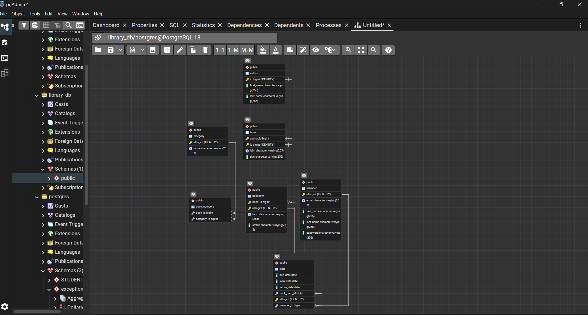

--ER DIAGRAM--

Category Management API Category modülü için CRUD (Create, Read, Update, Delete) işlemleri tamamlandı.
 Uygulama, veritabanı olarak PostgreSQL kullanmaktadır.

Category için save işlemi Postman ile test edildi.

Neler Yapıldı?

İş Mantığı (Business Logic): AuthorServiceImpl geliştirilerek yazar kayıt süreci tamamlandı.

Veri Temizliği (Normalization): Kullanıcıdan gelen isim ve soyisim verileri trim() ve toLowerCase() metodlarıyla normalize edildi. Böylece veritabanında gereksiz boşlukların ve büyük/küçük harf karmaşasının önüne geçildi.

Mükerrer Kayıt Kontrolü: existsByFirstNameIgnoreCaseAndLastNameIgnoreCase kullanılarak, aynı isim ve soyisimle ikinci bir yazarın kaydedilmesi engellendi.

MapStruct Entegrasyonu: DTO ve Entity dönüşümleri için MapStruct kullanıldı. authorName alanı, firstName ve lastName alanları birleştirilerek dinamik bir şekilde oluşturuldu.

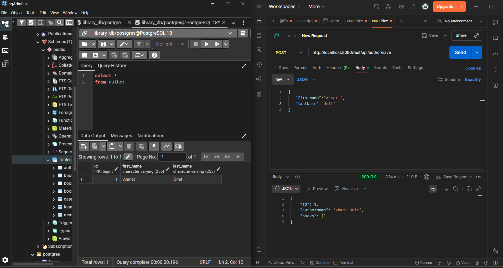

Aşağıdaki görselde, bir üye eklerken email formatına uymayan üyelerinsistem tarafından nasıl engellendiği görülmektedir.
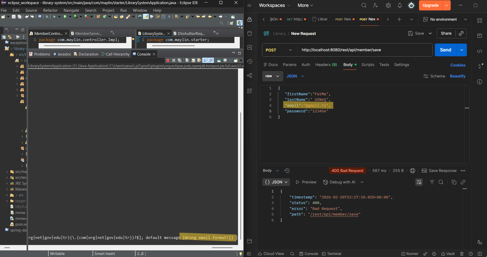

Projede kurulan exception handling mimarisini göstermektedir. Var olan bir yazar tekrar eklenmeye çalışıldığında sistem 409 Conflict HTTP kodu ile standart bir hata yanıtı döndürmektedir. Yanıt içeriğinde errorCode, message, path ve timestamp bilgileri yer almaktadır. Bu yapı BaseException, ErrorCode enum ve GlobalExceptionHandler kullanılarak kurulmuştur.
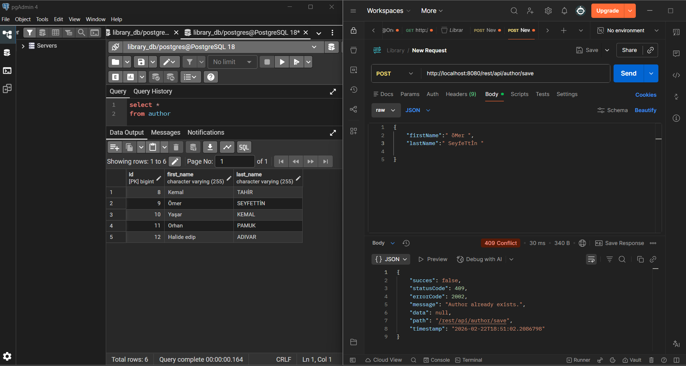

Book entiysi için save metodu eklenip test edildi.
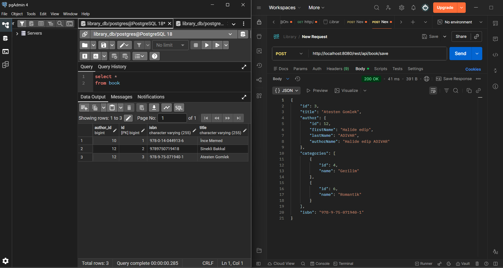

BookItem entitysi için save metodu eklenip test edildi.
-Kitaplara fiziksel kopya (BookItem) ekleme
- Benzersiz barkod kontrolü
- Otomatik AVAILABLE statüsü
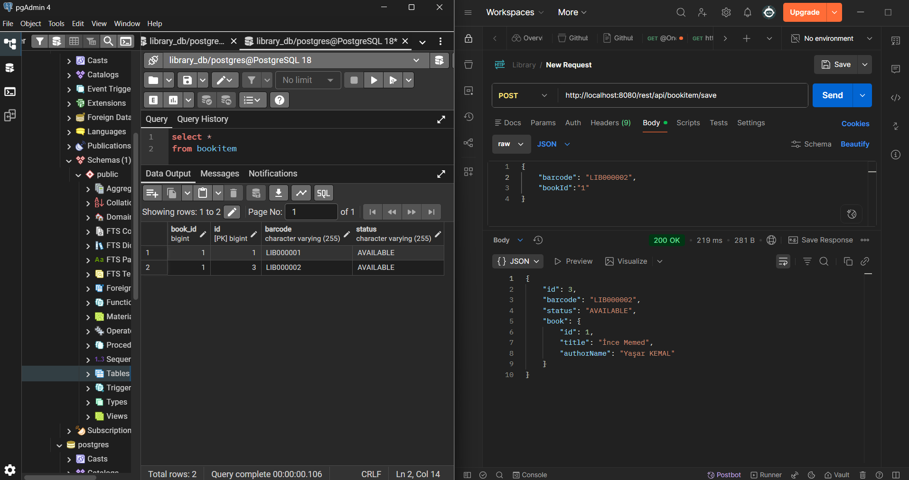

Kitap Ödünç Alma 

-Statusu available olan nüshayı başarıyla ödünç alma.
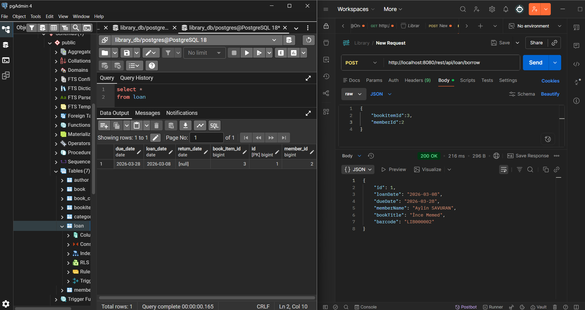

-Statusu available olmayan kitap ödünç alınma istendiğinde excepiton fırlatma.
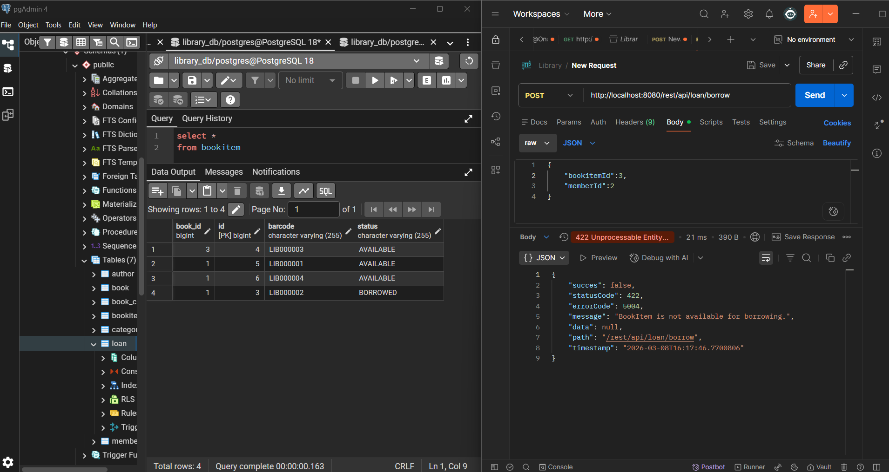

-Bir member en fazla 5 kitap alabilir kontrolü.
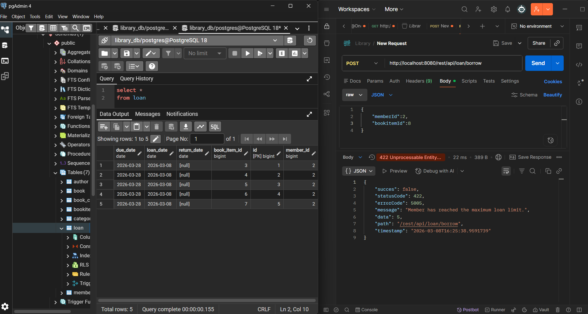

 Ödünç Yönetimi
 
 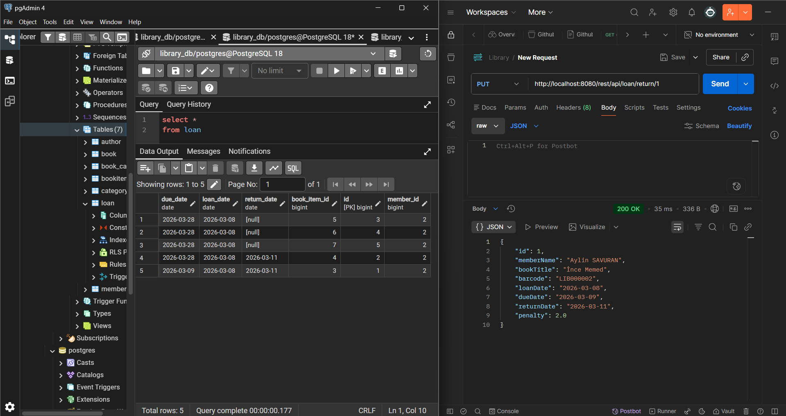
 
- Aktif loan ve gecikme kontrolü ile kitap ödünç alma
- Otomatik ceza hesaplamalı kitap iade etme
- Günlük ceza tutarı application.properties üzerinden ayarlanabilir

RestBaseController ile tek tipte (ApiResponse) veri dönüldü.
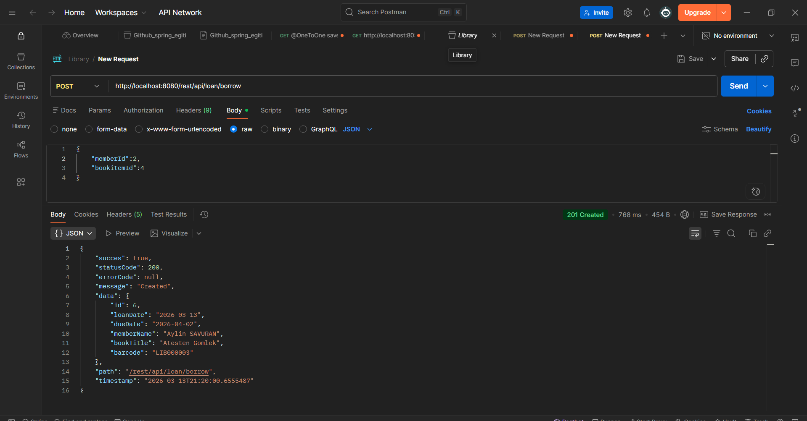

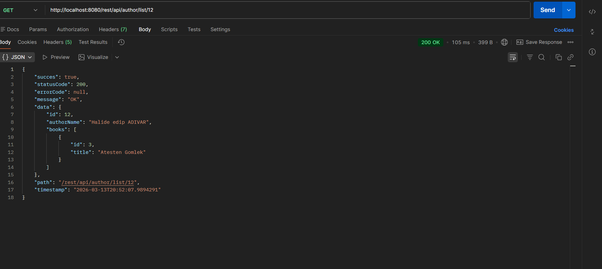
 