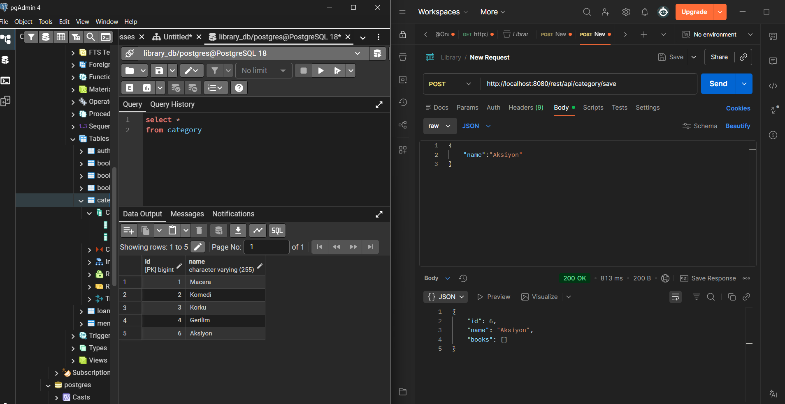

# Kütüphane Yönetim Sistemi (Library Management System) 📚

Bu proje, bir kütüphanenin temel işleyişini (üye, kitap, ödünç alma) yönetmek için geliştirilmektedir.

## ✅ Bugün Neler Yapıldı? (2026-02-08)
Bugün projenin **Domain Model (Entity)** katmanı ve veritabanı ilişkileri başarıyla tamamlandı:

* **Member & Loan:** Üye ve ödünç alma arasındaki `OneToMany` ilişkisi kuruldu. 👤📄
* **Book & BookItem:** Kitap genel bilgileri ile fiziksel kopyalar arasındaki ilişki yapılandırıldı. 📚🆔
* **ManyToMany İlişkisi:** Kitaplar ve Kategoriler (`Category`) arasındaki çoktan çoğa bağlantı kuruldu. 🏷️🔗
* **Veritabanı Yapılandırması:** PostgreSQL (pgAdmin) bağlantısı yapıldı ve `ddl-auto=update` ile tablolar otomatik oluşturuldu. 🐘
* **ER Diyagramı:** pgAdmin üzerinden tabloların ilişkisel haritası doğrulandı. 🗺️

--ER DIAGRAM--

Category Management API Category modülü için CRUD (Create, Read, Update, Delete) işlemleri tamamlandı.
 Uygulama, veritabanı olarak PostgreSQL kullanmaktadır.

Category için save işlemi Postman ile test edildi.
